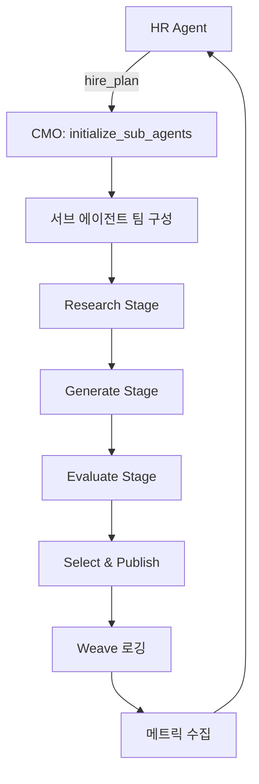

# CMO Agent 사용 가이드

## 🎯 개요

CMO (Chief Marketing Orchestrator) 에이전트는 HR Agent와 함께 작동하여 소셜 미디어 콘텐츠를 생성, 평가, 발행하는 마케팅 오케스트레이터입니다.

### 주요 특징

✅ **HR Agent 통합**: HR의 hire_plan을 받아 자동으로 서브 에이전트 팀 구성  
✅ **4단계 워크플로우**: Research → Generate → Evaluate → Publish  
✅ **멀티모달 콘텐츠**: 텍스트 + 이미지/비디오 프롬프트 페어  
✅ **안전성 검증**: Safety >= 0.8 필터링  
✅ **Weave 통합**: 자동 메트릭 로깅  

---

## 📦 구조

```
cmo_agent/
├── __init__.py           # 패키지 초기화
├── agent.py              # 메인 CMO 에이전트
├── schemas.py            # 데이터 스키마
├── tools.py              # 도구 함수들
├── sub_agents.py         # 서브 에이전트 관리
└── README.md             # 상세 문서
```

---

## 🚀 빠른 시작

### 1. HR Agent와 통합 사용 (권장)

```python
from cmo_agent.agent import initialize_sub_agents, orchestrate_content_creation
import json

# Step 1: HR Agent의 hire_plan으로 팀 초기화
hr_hire_plan = [
    {
        "slot": "writer/main",
        "ref": "ViralCopywriter",
        "patch": {},
        "reason": "고성능 카피 작성"
    },
    {
        "slot": "safety/main",
        "ref": "BrandSafetyValidator",
        "patch": {},
        "reason": "브랜드 안전성 검증"
    },
    # ... 더 많은 에이전트
]

# 서브 에이전트 팀 초기화
init_result = initialize_sub_agents(hr_hire_plan)
print(json.loads(init_result))

# Step 2: 콘텐츠 생성
result = orchestrate_content_creation(
    iteration=0,
    topic="AI agents that hire other AI agents",
    num_candidates=5,
    use_sub_agents=False  # True로 설정하면 실제 서브 에이전트 사용
)

result_data = json.loads(result)
print(result_data["selected"]["text"])
```

### 2. 독립 실행

```bash
# 커맨드라인에서 실행
python -m cmo_agent.agent "AI 에이전트 시스템"

# 또는 예제 스크립트 실행
python examples/cmo_simple_run.py
```

### 3. HR-CMO 통합 예제 실행

```bash
python examples/cmo_with_hr_integration.py
```

---

## 🔧 주요 함수

### `initialize_sub_agents(hire_plan)`
HR Agent의 hire_plan을 기반으로 서브 에이전트 팀을 초기화합니다.

```python
hire_plan = [
    {
        "slot": "writer/main",
        "ref": "ViralCopywriter",
        "patch": {},
        "reason": "Initial setup"
    }
]

result = initialize_sub_agents(hire_plan)
```

### `orchestrate_content_creation(iteration, topic, num_candidates, use_sub_agents)`
전체 콘텐츠 생성 프로세스를 오케스트레이션합니다.

**Parameters:**
- `iteration` (int): 현재 반복 횟수
- `topic` (str): 콘텐츠 주제
- `num_candidates` (int): 생성할 후보 수 (3-6 권장)
- `use_sub_agents` (bool): 실제 서브 에이전트 사용 여부
  - `False`: 시뮬레이션 모드 (빠름, 테스트용)
  - `True`: 실제 에이전트 호출 (API 키 필요)

**Returns:** JSON 형식의 실행 결과

---

## 📊 출력 예시

```json
{
  "iteration": 0,
  "candidates": [
    {
      "text": "우리는 AI가 다른 AI를 고용하는 시스템을 만들었습니다.",
      "media_prompt": "3D isometric illustration of AI agents recruiting each other",
      "mode": "image",
      "scores": {
        "clarity": 0.85,
        "novelty": 0.82,
        "shareability": 0.88,
        "credibility": 0.75,
        "safety": 0.95,
        "overall": 0.85
      }
    }
  ],
  "selected": {
    "text": "우리는 AI가 다른 AI를 고용하는 시스템을 만들었습니다.",
    "media_prompt": "3D isometric illustration of AI agents recruiting each other",
    "mode": "image",
    "expected_overall": 0.85
  },
  "publish_status": "queued",
  "feedback_summary": "최고 성과자: 높은 명확성, 뛰어난 참신성, 강한 공유 가능성. 안전한 톤, 개발자 친화적 메시지."
}
```

---

## 🤖 서브 에이전트 아키텍처

CMO는 다음 카테고리의 서브 에이전트들을 관리합니다:

### 1. Orchestrator
- **ContentTeamLead**: 콘텐츠 전략 가이드
- **CampaignManager**: 멀티데이 캠페인 조율

### 2. Writer
- **ViralCopywriter**: 고성능 카피 작성
- **Hooksmith**: 강력한 훅 생성
- **ThreadWriter**: 트위터 스레드 작성
- **ControversialTake**: 논쟁적 관점 제시

### 3. Media
- **MemeCreator**: 밈 콘텐츠 생성
- **ImageComposer**: 이미지 프롬프트 작성

### 4. Safety
- **BrandSafetyValidator**: 브랜드 안전성 검증
- **FactChecker**: 팩트 체크
- **ToneChecker**: 톤 검증

### 5. Critic
- **PerformanceAnalyst**: 성능 분석
- **AudienceResearcher**: 청중 분석

### 6. Intelligence
- **PerformanceAnalyst**: 메트릭 모니터링
- **AudienceResearcher**: 청중 데이터 분석
- **TimingOptimizer**: 최적 발행 시간 분석

---

## 📈 평가 기준

CMO는 다음 기준으로 콘텐츠를 평가합니다:

| 기준 | 가중치 | 설명 |
|------|--------|------|
| **Clarity** | 25% | 메시지 명확성 |
| **Novelty** | 25% | 참신성, 독창성 |
| **Shareability** | 30% | 공유 가능성, 바이럴 잠재력 |
| **Credibility** | 10% | 신뢰도 |
| **Safety** | 10% | 안전성 (최소 0.8 필요) |

**Overall Score** = Σ (기준 × 가중치)

---

## 🔄 워크플로우



---

## 🧪 테스트

```bash
# 전체 테스트 실행
python test_cmo_agent.py

# 간단한 실행 테스트
python examples/cmo_simple_run.py

# HR 통합 테스트
python examples/cmo_with_hr_integration.py
```

---

## 🐝 Weave 통합

모든 실행은 자동으로 Weave에 로깅됩니다:

```python
# 자동으로 로깅되는 항목:
# - 각 반복의 후보 점수
# - 선택된 콘텐츠
# - 예상 vs 실제 engagement
# - 서브 에이전트 호출 기록
```

Weave 프로젝트: `mason-choi-storika/WeaveHacks2`

---

## 💡 사용 팁

### 1. 시뮬레이션 vs 실제 모드

**시뮬레이션 모드** (`use_sub_agents=False`)
- ✅ 빠른 테스트
- ✅ API 키 불필요
- ✅ 안정적인 결과
- ❌ 실제 에이전트 품질보다 낮음

**실제 모드** (`use_sub_agents=True`)
- ✅ 최고 품질의 콘텐츠
- ✅ 실제 에이전트 활용
- ❌ API 키 필요
- ❌ 비용 발생

### 2. HR Agent와 함께 사용

```python
# 1. HR Agent로 팀 계획 생성
hr_result = hr_agent.analyze_team_and_decide(team_state)
hr_decisions = json.loads(hr_result)

# 2. CMO에 hire_plan 전달
initialize_sub_agents(hr_decisions["hire_plan"])

# 3. 콘텐츠 생성
result = orchestrate_content_creation(
    iteration=iteration,
    topic=topic,
    num_candidates=5,
    use_sub_agents=True
)
```

### 3. 반복 실행

```python
for iteration in range(10):
    result = orchestrate_content_creation(
        iteration=iteration,
        topic=f"AI agents - iteration {iteration}",
        num_candidates=5
    )
    
    # 결과 분석 및 다음 반복 계획
    # ...
```

---

## 🎨 스타일 가이드

CMO가 생성하는 콘텐츠는 다음 스타일을 따릅니다:

- **톤**: 대화형, 개발자 친화적
- **길이**: ≤180자 (Twitter 최적화)
- **형식**: 텍스트 + 미디어 프롬프트 페어
- **안전성**: Safety >= 0.8 필수

---

## 🤝 기여

개선 사항이나 버그 리포트는 환영합니다!

---

## 📚 추가 자료

- [CMO Agent 상세 문서](cmo_agent/README.md)
- [HR Agent 가이드](hr_validation_agent/README.md)
- [Archetype 정의](archetypes/)
- [Weave 프로젝트](https://wandb.ai/mason-choi-storika/WeaveHacks2)

