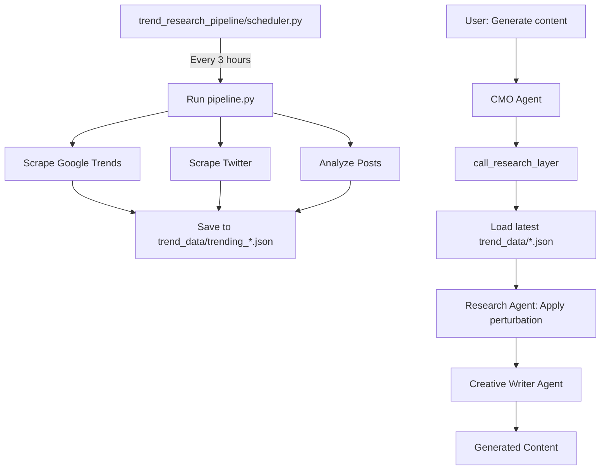

# Trend Pipeline Migration Guide

## Overview

The trending data collection system has been refactored into a clean, separate pipeline.

## What Changed

### Before (Old Structure)

```
trending-data-collection/      # Messy, mixed-purpose directory
├── scrapers/
│   ├── trending_data_pipeline.py
│   ├── google_trends_browserbase_scraper.py
│   └── twitter_browserbase_scraper.py
├── outputs/                   # Scattered outputs
├── debug_screenshots/         # Debug artifacts
└── old_scripts/               # Legacy code

cmo_agent/
└── sub_agents.py              # Research agent didn't read collected data
```

**Problems:**
- No clear separation between data collection and CMO research
- Research agent generated trends instead of reading collected data
- No automated 3-hour collection schedule
- Mixed debug/production artifacts
- Output format didn't match CMO expected schema

### After (New Structure)

```
trend_research_pipeline/       # Clean, single-purpose pipeline
├── scrapers/
│   ├── google_trends.py
│   ├── twitter_trends.py
│   └── post_analyzer.py
├── pipeline.py                # Orchestrator
├── scheduler.py               # 3-hour scheduler
├── config.py                  # Centralized config
├── requirements.txt
└── README.md

trend_data/                    # Timestamped outputs
└── trending_YYYYMMDD_HHMMSS.json

cmo_agent/
└── sub_agents.py              # Research agent reads from trend_data/
```

## Migration Benefits

### 1. Clear Separation of Concerns

**Data Collection (trend_research_pipeline/)**
- Runs every 3 hours (automated)
- Scrapes Google Trends + Twitter
- Saves raw data to `trend_data/`
- No AI inference, just data collection

**Research & Analysis (cmo_agent/sub_agents.py)**
- Runs on-demand when generating content
- Reads latest `trend_data/trending_*.json`
- Applies AI-powered perturbation & creative analysis
- Formats for content generation pipeline

### 2. Automated 3-Hour Collection

```bash
# Old way: Manual runs
cd trending-data-collection/scrapers
python trending_data_pipeline.py

# New way: Automated scheduler
cd trend_research_pipeline
python scheduler.py              # Runs every 3 hours
```

### 3. CMO Integration

**Before:** Research agent generated fake trends

```python
# Old behavior
call_research_layer(topic="AI Agents")
# → Agent invents trends from knowledge, no real data
```

**After:** Research agent reads real collected data

```python
# New behavior
call_research_layer()  # topic optional
# → Loads trend_data/trending_20251011_183000.json
# → Analyzes real Twitter + Google Trends data
# → Applies creative perturbation
# → Returns enriched analysis
```

## Data Flow



## How to Use

### Step 1: Start Automated Collection

```bash
cd trend_research_pipeline
python scheduler.py
```

Leave this running. It will collect trend data every 3 hours.

### Step 2: Generate Content with CMO

```python
from cmo_agent.agent import root_agent

# CMO automatically reads latest trend data
response = root_agent.execute("Generate next content")
```

The research layer will:
1. Load `trend_data/trending_YYYYMMDD_HHMMSS.json`
2. Extract relevant trends for AI/ML audience
3. Apply creative perturbation
4. Feed into content generation pipeline

## Output Schema

### Raw Collection (`trend_data/trending_*.json`)

```json
{
  "pipeline_metadata": {
    "pipeline_timestamp": "2025-10-11T18:30:00Z",
    "collection_interval_hours": 3
  },
  "data_sources": {
    "google_trends": {
      "collected": true,
      "data": [...]
    },
    "twitter_trends": {
      "collected": true,
      "data": {...}
    },
    "trending_posts": {
      "collected": true,
      "data": {...}
    }
  },
  "key_insights": {...}
}
```

### Research Layer Output (After Perturbation)

```json
{
  "trending_topics": [
    {
      "topic_name": "Multi-Agent Systems & Orchestration",
      "relevance_score": 0.96,
      "timeliness_score": 0.99,
      "source": "Both",
      "hashtags": ["#MultiAgent", "#AIAgents"]
    }
  ],
  "audience_insights": "AI/ML developers are interested in...",
  "viral_potential_angles": [
    {
      "angle_summary": "Behind-the-scenes agent debugging challenges",
      "hook_template": "We debugged 1000 agent coordination failures. Here's what we learned:",
      "why_viral": "Transparency + real numbers resonate with builders"
    }
  ],
  "perturbations_applied": [
    "Added contrarian angle on agent complexity",
    "Combined Google Trends + Twitter sentiment"
  ]
}
```

## Backward Compatibility

### Old Directory (trending-data-collection/)

**Status:** Kept for reference, not deleted

**Reason:** Contains documentation, debug artifacts, and original implementation

**Migration:** All scrapers copied to `trend_research_pipeline/scrapers/`

**Action:** Can be archived or deleted after verification

### CMO Agent

**Status:** Updated to read trend data

**Backward Compatibility:** Falls back gracefully if no trend data available

```python
# If trend_data/ is empty
call_research_layer()
# → Prints warning
# → Uses fallback research mode
# → Still generates content
```

## Verification

### Check Pipeline is Working

```bash
# 1. Verify scheduler is running
ps aux | grep scheduler.py

# 2. Check trend data files exist
ls -lh trend_data/

# 3. Verify latest file is recent (< 3 hours old)
ls -lt trend_data/trending_*.json | head -1

# 4. Check file size (should be > 10KB)
du -h trend_data/trending_*.json | tail -1
```

### Check CMO Integration

```python
from cmo_agent.sub_agents import load_latest_trend_data

# Should print: "📊 Loading trend data from: trending_*.json"
data = load_latest_trend_data()

if data:
    print("✅ CMO can read trend data")
else:
    print("⚠️ No trend data found")
```

## Troubleshooting

### "No trend data files found"

**Solution:** Run pipeline at least once

```bash
cd trend_research_pipeline
python pipeline.py
```

### "trend_data/ directory not found"

**Solution:** Create directory

```bash
mkdir -p trend_data
```

### Pipeline fails to scrape

**Solution:** Check Browserbase credentials

```bash
# In .env file
BROWSERBASE_API_KEY=your_key
BROWSERBASE_PROJECT_ID=your_project_id
```

## Next Steps

### Production Deployment

1. **Use cron instead of Python scheduler:**

```bash
crontab -e
# Add: 0 */3 * * * cd /path/to/trend_research_pipeline && python pipeline.py
```

2. **Monitor logs:**

```bash
# Add logging to cron
0 */3 * * * cd /path/to/trend_research_pipeline && python pipeline.py >> /var/log/trend_pipeline.log 2>&1
```

3. **Set up file retention:**

```bash
# Delete files older than 7 days
0 0 * * * find /path/to/trend_data -name "trending_*.json" -mtime +7 -delete
```

### Future Enhancements

- Add more data sources (Reddit, HackerNews, ProductHunt)
- Implement incremental updates (delta between collections)
- Add alerting for collection failures
- Store historical performance metrics
- Build trend comparison over time

## Documentation

- **Pipeline:** `trend_research_pipeline/README.md`
- **CMO Integration:** `cmo_agent/sub_agents.py` (see `load_latest_trend_data()`)
- **Configuration:** `trend_research_pipeline/config.py`
- **Example Schema:** `trends_refactored.json`

## Questions?

Check:
1. `trend_research_pipeline/README.md` - Pipeline usage
2. `cmo_agent/sub_agents.py::load_latest_trend_data()` - Integration code
3. Console logs for "📊 Loading trend data from..." messages
